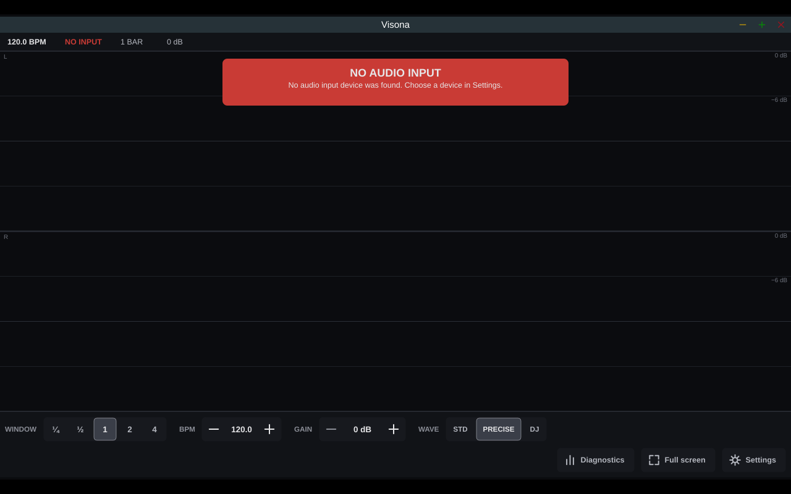

# Visona

**Visona** is a beat-synced stereo oscilloscope for music production. It shows your audio as a musical sweep scope locked to MIDI Clock from your DAW, with manual tempo when no clock is present. As a VST3 plugin it follows the DAW's transport directly.



## Download

Pre-built binaries are published on **[GitHub Releases](https://github.com/stephanterning/visona/releases)**.

| Platform | Requirement | Package |
| --- | --- | --- |
| **macOS** | Apple Silicon, macOS 14 or later | `Visona-macos-arm64.zip` — unzip and open `Visona.app` |
| **macOS VST3** | Apple Silicon, macOS 14 or later | `Visona-vst3-macos-arm64.zip` — copy `Visona.vst3` to `~/Library/Audio/Plug-Ins/VST3/` ([plugin guide](docs/plugins.md)) |
| **macOS VST3, Visona Sync** | Apple Silicon, macOS 14 or later | `Visona-sync-vst3-macos-arm64.zip` — copy `Visona Sync.vst3` to the same folder ([sidechain sync](docs/plugins.md#sidechain-sync-visona-sync)) |
| **Raspberry Pi** | Raspberry Pi OS 64-bit (desktop), ARM64 | `Visona-linux-arm64-pi.tar.gz` — see [Pi setup](docs/pi-setup.md) and [kiosk mode](docs/pi-kiosk.md) |

Alpha builds are **unsigned**. On macOS, if Gatekeeper blocks the app, remove the quarantine flag:

```sh
xattr -cr /path/to/Visona.app
```

For the VST3 plugins, remove the quarantine flag after copying them, then sign them ad hoc on your Mac. A DAW may refuse to load a bundle that is quarantined or whose signature no longer matches, for example after it was copied or rebuilt:

```sh
xattr -cr ~/Library/Audio/Plug-Ins/VST3/Visona.vst3
xattr -cr ~/Library/Audio/Plug-Ins/VST3/Visona\ Sync.vst3
codesign --force --sign - --deep ~/Library/Audio/Plug-Ins/VST3/Visona.vst3
codesign --force --sign - --deep ~/Library/Audio/Plug-Ins/VST3/Visona\ Sync.vst3
```

Then restart the DAW or rescan its plugins.

The **VST3 plugin** (pass-through stereo effect, host transport) ships alongside the standalone app on macOS. **Visona Sync**, a companion instrument, puts a bar impulse on the plugin's sidechain so Visona can measure how late audio arrives after plugins with latency in Ableton Live, and draw it on the grid. AU and CLAP are planned next. See [docs/plugins.md](docs/plugins.md).

## What you get

- **Sweep scope** with bar grid, stacked L/R lanes and a bright write head
- **MIDI Clock** sync with Start, Stop, Continue and Song Position Pointer
- **FREE mode** — free-running sweep at a manual BPM when MIDI Clock is absent
- **Windows** from ¼ bar to 4 bars, **horizontal zoom** and a **measurement ruler**
- **Waveform modes** STD, PRECISE and DJ (frequency colouring in DJ mode)
- **Display gain** 0–36 dB, settings persistence, fullscreen

Works with professional USB audio interfaces. Development and testing use an **RME Babyface Pro FS**; on Linux and Raspberry Pi the interface must run in **USB Class Compliant mode**.

## Quick start (macOS)

1. Download the latest release and open `Visona.app`.
2. Connect your audio interface and a MIDI clock source (optional).
3. In **Settings**, choose the audio input device and MIDI port.
4. Press **D** to toggle the diagnostics overlay.

## Raspberry Pi appliance

See [docs/pi-setup.md](docs/pi-setup.md), [docs/pi-build.md](docs/pi-build.md) and [docs/pi-kiosk.md](docs/pi-kiosk.md). For normal use, download the release tarball rather than building on the Pi; it holds the binary and the kiosk scripts.

## License

AGPL-3.0-or-later. See [LICENSE](LICENSE).

## Developers

Build and test instructions are in [AGENTS.md](AGENTS.md). Architecture, roadmap and decisions live under [docs/](docs/).
